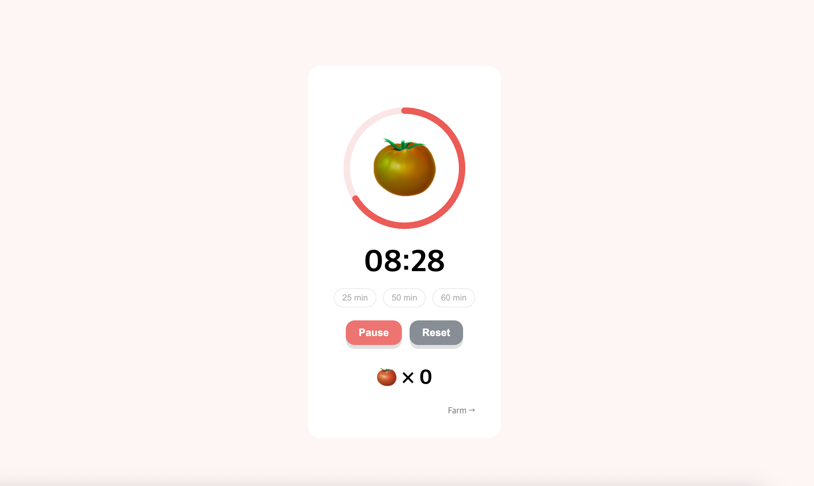

# Tomato Timer

인터랙티브한 토마토 성장 애니메이션과 함께 집중 시간을 기록하는 Pomodoro Timer 웹앱입니다.  
집중 시간이 누적될수록 토마토가 익어가며, 하루 동안 수확한 토마토를 농장 형태로 확인할 수 있습니다.



---

## Preview

- 토마토가 시간에 따라 자연스럽게 익어가는 인터랙션
- SVG 기반 원형 프로그래스 타이머
- 25 / 50 / 60분 타이머 선택
- 집중 시간 누적 기반 토마토 수확 시스템
- 월별 토마토 농장 기록 UI
- PWA 지원 (홈 화면 추가 가능)

---

# Tech Stack

- Next.js 15
- TypeScript
- Zustand
- SCSS (BEM 구조)
- LocalStorage
- PWA

---

# Features

## Interactive Tomato Timer

집중 시간이 흐를수록 토마토의 색이 변화합니다.

- 초록 → 빨강으로 자연스럽게 변화
- SVG 원형 프로그래스 애니메이션
- requestAnimationFrame 기반 부드러운 진행 효과

---

## Focus Time System

완료 횟수가 아닌 누적 집중 시간을 기준으로 토마토를 수확합니다.

| Focus Time | Tomato |
|---|---|
| 25 min | 🍅 x1 |
| 50 min | 🍅 x2 |
| 75 min | 🍅 x3 |

```ts
tomatoCount = Math.floor(focusTime / 1500)
```

---

## Tomato Farm

집중 기록을 GitHub 잔디 스타일의 농장 UI로 시각화했습니다.

- 월별 이동 가능
- 날짜별 수확량 확인
- hover tooltip 지원
- localStorage 기반 기록 저장


---

# Future Improvements

- 사용자 커스텀 타이머 설정
- 사운드 및 알림 기능
- 통계 페이지 추가
- 다크 모드
- 모바일 위젯 대응

---

# Deploy

Vercel을 통해 배포했습니다.

```bash
git push
```

자동으로 재배포됩니다.

